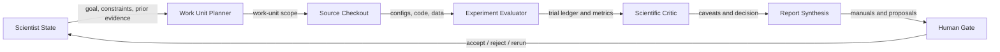

# BTC AutoResearch v1

<strong>Scientist ID:</strong> btc_autoresearch_v1

<strong>Task:</strong> btc

<strong>Status:</strong> active

<strong>Updated:</strong> 2026-06-10 00:27 KST

## Purpose

BTC AutoResearch v1 studies BTCUSDT short-horizon backtests through an AI-scientist loop. It searches for candidate trading configurations, audits the research pipeline, preserves negative findings, and gates any promotion through explicit evidence.

The scientist is not a live-trading system. It does not place orders, use private exchange credentials, or authorize deployment of a strategy.

## Goal And Target Metric

Specific goal: improve the BTCUSDT short-horizon research pipeline to find a better backtested candidate while preserving causal, comparable, cost-correct evaluation.

| Field | Value |
| --- | --- |
| Target metric | `backtested_net_return` |
| Direction | maximize |
| Evaluation context | Official BTC research backtester under 1x transaction-cost assumptions, with audit metrics reported before any sealed holdout use. |

## Non-Negotiable Constraints

- Do not change backtester accounting, transaction costs, timestamp alignment, walk-forward splits, or sealed holdout protection to inflate performance.
- Preserve failed and rejected trials in ledgers.
- Report fold stability, cost sensitivity, random-baseline comparison, drawdown, and profit concentration.
- Do not use live trading, private API keys, or account credentials.
- Do not touch the sealed holdout during exploratory research.

## Agent And Tool Roles

| Role | Responsibility | Current BTC Example |
| --- | --- | --- |
| Work Unit Planner | Chooses bounded next investigations from current scientist state. | Opened baseline reproduction, pipeline audit, H4 audit, regime probe, and synthesis work units. |
| Source Checkout / Tool Runner | Runs reproducible code and commands against immutable source refs. | Uses `sources/checkouts/btc_autoresearch` at git ref `ca251130e1f97b6233ceb957cb85e209bc136073`. |
| Experiment Evaluator | Produces trial ledgers, metrics, backtests, and audit records. | Extended the M5 score-search ledger to 100 trials. |
| Scientific Critic / Auditor | Checks leakage, horizon mismatch, cost stress, concentration, fold stability, and invalid shortcuts. | Flagged H=4 horizon mismatch and `t094` concentration risk. |
| Report Synthesis | Preserves findings and next actions in scientist and work-unit manuals. | Summarized the overnight run and conservative next step. |
| Human Gate | Accepts, rejects, reruns, or requests a next-version proposal. | Current gate: robustness work before holdout. |

## Workflow

Machine-readable workflow reference: `docs/assets/ai-lab-scientist-workflow.yaml`.

## Assets And Provenance

| Asset | Type | Role | Provenance / Limits |
| --- | --- | --- | --- |
| `upstream_repo` | code repository | Source ref and shared checkout for optimized BTC research code. | `sources/sources.yaml`; git ref `ca251130e1f97b6233ceb957cb85e209bc136073`; checkout may contain ignored generated artifacts. |
| `btcusdt_futures_1h_dataset` | dataset | Main ML/backtest dataset. | Built locally from Binance public futures data; expected processed file `data/processed/BTCUSDT_futures_um_1h.parquet`. |
| `baseline_t054` | result bundle | Local baseline comparison. | Reproduced locally with updated metrics; still below buy-and-hold over the same OOS window. |
| `btc-trials.json` | static public plot data | Curated documentation dataset for hover inspection. | `docs/assets/btc-trials.json`; derived from selected local ledger rows and report summaries. |

## Current Result

Best headline H=1 candidate from the 100-trial ledger:

- `t094_f321ec793728`: `returns_only`, `H=1`, `long_cash`, `cost_aware`, lambda `5.0`
- Net `+231.1%`, Sharpe `1.05`, max drawdown `-38%`, trades `25`
- Beats reproduced `t054` on net return and Sharpe, and beats buy-and-hold over the same OOS window
- Custom pre-holdout audit recommendation: `NEEDS_REFINEMENT`

Reason not promoted: only `6/14` folds were positive and profit concentration top-5 was `0.887`.

## Baseline

The local reproduced baseline is `t054_a19bd141e75b`:

- `technical_core`, `H=1`, `long_cash`, `cost_aware`, lambda `3.0`
- Net `+94.0%`, Sharpe `0.71`, max drawdown `-41%`, trades `70`
- M5.5 audit: `READY_FOR_ONE_SHOT_HOLDOUT`
- Funding-aware net: `+72.4%`
- Fold-positive `8/14`; PBO `0.4127`; comparable DSR `0.4570`

This differs from the earlier documented `+60.0%` baseline, likely because the local data build now runs through `2026-05-31`.

## Score-Search Plot

The plot below shows selected score-maximizing BTC trials. It is one evidence surface, not the whole scientist.

Hover over points to inspect hypothesis, config snippet, trace/report snippet, metric delta, and status. High return alone is not a promotion decision.

## Trial Interpretations

| Trial | Status | Interpretation |
| --- | --- | --- |
| `t054_a19bd141e75b` | accepted baseline | Reproduced local baseline under preserved cost, split, timestamp, and holdout rules. |
| `t094_f321ec793728` | needs refinement | Strong H=1 result, robust to several cost checks, but weak fold coverage and high concentration block promotion. |
| `t063_72e951d8c632` | accepted with caveat | H=4 default result looked strong, but horizon-matched audit collapsed net return from `+155.6%` to `-3.9%`. |
| `t096_c1a908fe1a33` | accepted with caveat | H=4 default result dropped from `+130.6%` to `+47.9%` under horizon-matched holding, below the reproduced baseline. |
| `t095_03b7ec1f8ead` | rejected | Very high headline return but too few trades and profit concentration make it unreliable. |

## Work Units

| Work Unit | Status | Result | Manual |
| --- | --- | --- | --- |
| `baseline_reproduction` | complete | Readiness gate passed; `t054` reproduced locally at `+94.0%`. | [Manual](work-units/baseline-reproduction.md) |
| `pipeline_audit` | complete | No accounting/split/holdout blocker found; reporting hygiene caveats recorded. | [Manual](work-units/pipeline-audit.md) |
| `horizon_h4_audit` | complete | H=4 default winners weaken sharply under horizon-matched holding. | [Manual](work-units/horizon-h4-audit.md) |
| `regime_filter_probe` | complete | `t094` is promising but weak on fold coverage and concentration. | [Manual](work-units/regime-filter-probe.md) |
| `report_synthesis` | complete | Reports updated and safety status recorded. | [Manual](work-units/report-synthesis.md) |

## Failure Modes To Watch

- Headline return driven by too few trades.
- Profit concentration in a small number of trades.
- H>1 forecasts evaluated with a mismatched holding rule.
- Cost sensitivity that collapses under stress.
- Fold performance unstable across time.
- Any change to accounting, timestamp alignment, split policy, or sealed holdout rules.

## Current Decision

Continue with a narrow `t094` robustness work unit. Do not promote to sealed holdout yet. Do not promote H>1 candidates until horizon-matched holding is part of the primary search and ranking path.

## Implementation References

- Scientist manifest: `tasks/active/btc/scientists/btc_autoresearch_v1/scientist.yaml`
- Scientist report: `tasks/active/btc/scientists/btc_autoresearch_v1/report.md`
- Source map: `tasks/active/btc/scientists/btc_autoresearch_v1/source-map.md`
- Trial ledger: `sources/checkouts/btc_autoresearch/results/reports/m5_autoresearch/trial_ledger.parquet`
- Curated plot data: `docs/assets/btc-trials.json`
