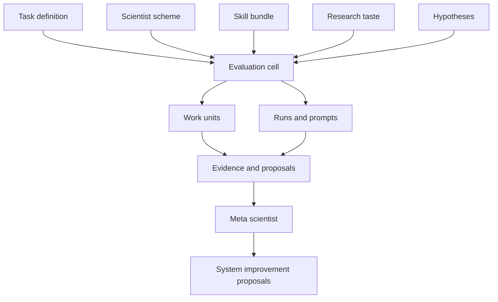

# Architecture

The AI Lab matrix separates task definitions, reusable scientist schemes, component catalogs, and operational evaluation cells. This lets the same task be attempted by different scientist schemes, and the same scheme be moved to a different task without carrying hidden task-specific assumptions.

## Architecture In One Sentence

An evaluation cell is the executable comparison object: it binds one task, one scientist scheme, selected scientist components, a target metric, constraints, a run spec, and evidence.

## Artifact Roles

| Artifact | Role | Path |
| --- | --- | --- |
| Task catalog | Human-readable index of known task families. | `catalog/tasks.yaml` |
| Task manifest | Broad task state, assets, candidate metrics, and constraints. | `tasks/active/<task_id>/task.yaml` |
| Scheme catalog | Human-readable index of reusable scientist schemes. | `catalog/scientist-schemes.yaml` |
| Scheme manifest | Reusable AI scientist orchestration pattern. | `schemes/<scheme_id>/scheme.yaml` |
| Skill-bundle catalog | Reusable domain, execution, evaluation, and synthesis capabilities. | `catalog/skill-bundles.yaml` |
| Research-taste catalog | Prioritization and judgment profiles for choosing hypotheses and evidence. | `catalog/research-tastes.yaml` |
| Hypothesis catalog | Task-specific falsifiable claims, required skills, suggested tests, and decisions. | `catalog/hypotheses.yaml` |
| Evaluation cell manifest | One task-by-scheme application, target metric, constraints, and work-unit state. | `evaluations/active/<cell_id>/evaluation-cell.yaml` |
| Cell run spec | Machine-readable fixed command loop, source gates, artifacts, synthesis, and exit conditions. | `evaluations/active/<cell_id>/run-spec.yaml` |
| Work-unit manifest | Focused method, audit, ablation, proxy, or synthesis state. | `evaluations/active/<cell_id>/work_units/<work_unit_id>/work-unit.yaml` |
| Prompt manifest | Local index of exact prompts used in a run. | `evaluations/active/<cell_id>/runs/<run_id>/prompt-manifest.yaml` |
| Meta-scientist manifest | System analysis authority, inputs, and outputs. | `meta/active/<meta_id>/meta-scientist.yaml` |

## Layer Responsibilities

| Layer | Owns | Does not own |
| --- | --- | --- |
| Lab | Shared policies, source registry, durable memory, catalogs, docs standards, automation conventions. | A task-specific target metric. |
| Task | Dataset family, benchmark contract, admissible assets, constraints, candidate metrics. | A particular scientist scheme's control flow. |
| Scientist scheme | Reusable orchestration pattern, roles, proposal cadence, critique rules, synthesis expectations. | Domain-specific claims that should live as hypotheses. |
| Evaluation cell | The binding between one task and one scheme, including target metric, run spec, artifacts, and evidence. | Global policy changes or silent metric changes. |
| Work unit | One focused unit of research, audit, proxy construction, ablation, synthesis, or infrastructure. | The entire scientist identity. |
| Meta scientist | Cross-cell diagnosis and proposals to improve the lab. | Direct mutation of current cells without acceptance. |

## Artifact Lifecycle

1. A task starts as a broad challenge in `catalog/tasks.yaml`.
2. Active task state moves into `tasks/active/<task_id>/task.yaml`.
3. A reusable scheme is described under `schemes/<scheme_id>/`.
4. Skills, taste, and hypotheses are selected from `catalog/`.
5. An evaluation cell is created under `evaluations/active/<cell_id>/`.
6. Work units and run specs produce evidence under the cell.
7. Reports summarize what happened without deleting the raw evidence needed for review.
8. Accepted changes create a new task, scheme, cell, or scientist component version rather than rewriting history.

This lifecycle keeps experimental state explicit. A failed run can still be useful evidence, but a failed run should not become hidden state in the next run.

## Execution Flow

1. Choose a task and a reusable scheme.
2. Choose the skill bundle and research taste profile the scientist may use.
3. Seed or select hypotheses to test.
4. Initialize an evaluation cell with a task-specific target metric, scientist composition, and constraints.
5. Add or validate a fixed `run-spec.yaml`.
6. Run scoped work units and preserve failed trials, commands, outputs, prompts, and proposals.
7. Compare cells across the matrix.
8. Let the meta scientist write analyses and proposals for system improvements.

Long-running cells use `run-spec.yaml` as the executable contract. `bin/ai-lab cell run-spec validate --all` checks active specs, and `bin/ai-lab cell run ... --dry-run` prints the fixed command plan without executing experiments.

## Run Specs

Run specs are the repo's answer to brittle one-off instructions. A run spec should state:

- the schema and run profile;
- source gates that must pass before work begins;
- runtime checks and tests;
- command sequence or built-in synthesis action;
- expected artifacts;
- exit criteria;
- wall-clock limits;
- cleanup policy.

The runner turns a spec into an event stream and run directory. This is intentionally more rigid than asking an agent to "do research" because it gives the next reviewer a contract to inspect.

## Work Units Versus Runs

A run is an execution instance. A work unit is a research context.

One run can execute several work units, and one work unit can require several runs. For example, a BTC turnover audit might be a work unit, while its candidate sweep and confirmation sweep are separate commands inside one run. Keeping the distinction matters because the meta scientist should reason about research decisions, not only shell executions.

## Comparison Surface

The evaluation matrix is the primary comparison surface. A fair comparison requires:

- the same task contract;
- the same target metric or an explicitly versioned metric;
- the same source gates;
- compatible wall-clock and compute budgets;
- preserved artifacts for both successes and failures;
- a synthesis summary that names the scientist composition.

When any of these differ, the comparison should be labeled as exploratory rather than decisive.

## Change Control

Current metrics and constraints should not be mutated in place after evidence exists. If a work unit discovers that the metric is flawed, it should write a proposal and create a new version after acceptance. This avoids retroactively changing what old runs meant.
