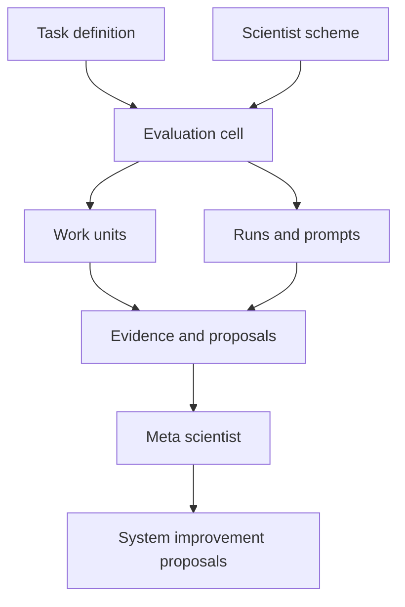

# Architecture

The AI Lab matrix separates task definitions, reusable scientist schemes, and operational evaluation cells.

## Artifact Roles

| Artifact | Role | Path |
| --- | --- | --- |
| Task manifest | Broad task state, assets, candidate metrics, and constraints. | `tasks/active/<task_id>/task.yaml` |
| Scheme manifest | Reusable AI scientist orchestration pattern. | `schemes/<scheme_id>/scheme.yaml` |
| Evaluation cell manifest | One task-by-scheme application, target metric, constraints, and work-unit state. | `evaluations/active/<cell_id>/evaluation-cell.yaml` |
| Cell run spec | Machine-readable fixed command loop, source gates, artifacts, synthesis, and exit conditions. | `evaluations/active/<cell_id>/run-spec.yaml` |
| Work-unit manifest | Focused method, audit, ablation, proxy, or synthesis state. | `evaluations/active/<cell_id>/work_units/<work_unit_id>/work-unit.yaml` |
| Prompt manifest | Local index of exact prompts used in a run. | `evaluations/active/<cell_id>/runs/<run_id>/prompt-manifest.yaml` |
| Meta-scientist manifest | System analysis authority, inputs, and outputs. | `meta/active/<meta_id>/meta-scientist.yaml` |

## Execution Flow

1. Choose a task and a reusable scheme.
2. Initialize an evaluation cell with a task-specific target metric and constraints.
3. Add or validate a fixed `run-spec.yaml`.
4. Run scoped work units and preserve failed trials, commands, outputs, prompts, and proposals.
5. Compare cells across the matrix.
6. Let the meta scientist write analyses and proposals for system improvements.

Long-running cells use `run-spec.yaml` as the executable contract. `bin/ai-lab cell run-spec validate --all` checks active specs, and `bin/ai-lab cell run ... --dry-run` prints the fixed command plan without executing experiments.
