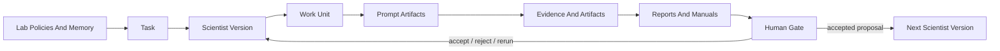
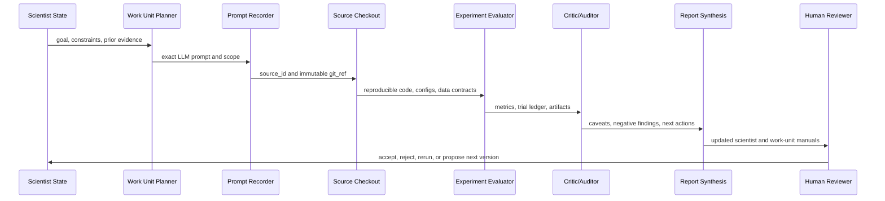

# System Architecture

The AI Lab stores research state as Markdown, YAML, JSON, local prompt artifacts, and static assets. The public site renders that state as a manual, not as a separate application.

## Agentic Flow

## Scientist Loop

## Canonical Artifact Types

| Artifact | Purpose | Typical Location |
| --- | --- | --- |
| Task manifest | Broad task state and active scientists. | `tasks/active/<task_id>/task.yaml` |
| Scientist manifest | Versioned scientist goal, metric, constraints, assets, and reports. | `tasks/active/<task_id>/scientists/<scientist_id>/scientist.yaml` |
| Scientist run spec | Machine-readable fixed command loop, source gates, artifacts, synthesis, and exit conditions. | `tasks/active/<task_id>/scientists/<scientist_id>/run-spec.yaml` |
| Scientist manual | Human-readable operating manual for a scientist. | `docs/scientists/<scientist_id>/` |
| Work-unit manifest | Work-unit scope, method, source refs, and decision state. | `tasks/active/<task_id>/scientists/<scientist_id>/work_units/<work_unit_id>/work-unit.yaml` |
| Work-unit manual | Human-readable operating manual for a work unit. | `docs/scientists/<scientist_id>/work-units/` |
| Run prompt manifest | Local index of exact prompts used in a run. | `tasks/active/<task_id>/scientists/<scientist_id>/runs/<run_id>/prompt-manifest.yaml` |
| Prompt artifact | Exact prompt text for one LLM run or run phase. | `tasks/active/<task_id>/scientists/<scientist_id>/runs/<run_id>/prompts/<prompt_id>.md` |
| Source registry | Durable identity and immutable refs for external codebases. | `sources/sources.yaml` |
| Static plot data | Public, curated visualization dataset. | `docs/assets/*.json` |

## Why Static Documentation

The site uses MkDocs, Mermaid, Vega-Lite, and static files because lab members should be able to inspect and edit the manual without running a backend or frontend application. Static documentation is also easier to review, deploy, archive, and reproduce.

Exact run prompts are kept as local artifacts rather than pasted into public pages. The public manual explains where those artifacts live and what they controlled.

## Rigid Scientist Runs

Long-running scientists use `run-spec.yaml` as the executable contract. The run spec pins source gates, exact commands, timeouts, declared artifacts, synthesis, and loop exit conditions. `bin/ai-lab scientist run-spec validate --all` checks active specs, and `bin/ai-lab scientist run ... --dry-run` prints the fixed command plan without executing experiments.
