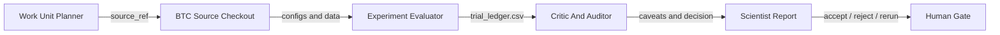

# First BTC Trial Inspection

## Goal

Inspect a BTC scientist score-search plot and connect plotted points back to trial detail pages and work-unit evidence.

This tutorial uses curated rows from the local 100-trial BTC ledger. The plot is useful for seeing which score-maximizing candidates look promising, but it does not replace audits, reruns, or scientist reports.

## Prerequisites

- The AI Lab workspace exists locally.
- You understand that BTC backtests are research evidence, not live-trading authorization.
- The sealed holdout remains unused during exploratory research.

## Example Command

The underlying BTC work used local work-unit commands rather than a single generic runner. A representative status command is:

```sh
bin/ai-lab scientist status btc btc_autoresearch_v1
```

Score-search trials are recorded in the upstream checkout ledger and summarized here as static JSON.

## Scientist Loop



## BTC Score-Search Plot

<div class="autoresearch-vega-plot" data-json="../../assets/btc-trials.json" data-title="BTC score-search trial inspection"></div>

Click a highlighted point to open its trial detail page when a detail page exists.

## How To Read Hover Fields

- `hypothesis`: the research claim the candidate tests.
- `config snippet`: the compact settings needed to understand the point.
- `trace/report snippet`: a short excerpt from the ledger or work-unit reports.
- `metric delta`: the change relative to the reproduced `t054` baseline.
- `status`: the current interpretation, not just the numeric rank.

High return alone is not a promotion decision. For example, `t094` has a strong net return but needs refinement because fold coverage is weak and profit concentration is high. H=4 points need horizon-matched interpretation before they can be compared fairly.

## Detail Pages

- [t054 baseline](../trials/trial_t054.md)
- [t094 needs refinement](../trials/trial_t094.md)
- [t063 H4 caveat](../trials/trial_t063.md)
- [Work-unit evidence](../work-units/index.md)
