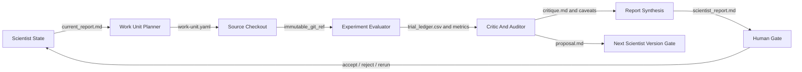
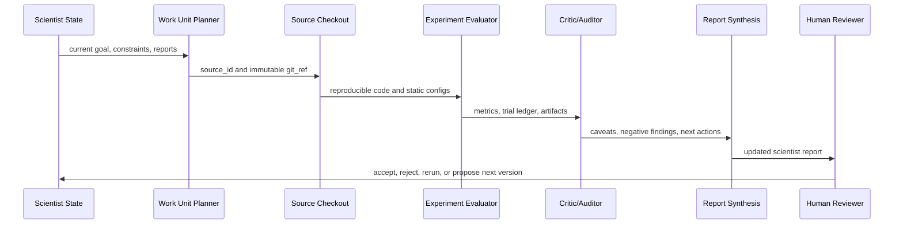

# AI Lab Scientist Loop

The AI Lab loop is broader than a score search. A scientist may open work units that reproduce a baseline, audit leakage risks, run score-maximizing trials, test a negative finding, synthesize reports, or propose a next scientist version.

The current BTC scientist uses this loop for BTCUSDT short-horizon backtesting. The performance plot in the first tutorial shows score-search trials, while the work-unit index records audits and synthesis work that do not necessarily improve the target metric directly.

## Flowchart

## One Loop

## BTC Example

The BTC scientist has five current work units:

- `baseline_reproduction`: reproduced `t054` and verified readiness.
- `pipeline_audit`: checked leakage, costs, timestamp alignment, and holdout protection.
- `horizon_h4_audit`: found that H=4 default candidates weaken under horizon-matched holding.
- `regime_filter_probe`: audited `t094` and kept it at needs-refinement status.
- `report_synthesis`: summarized the overnight run and next action.

The machine-readable example workflow is stored at [ai-lab-scientist-workflow.yaml](../assets/ai-lab-scientist-workflow.yaml).

The score-search plot is shown in [First BTC trial inspection](../tutorials/first-btc-trial.md).
